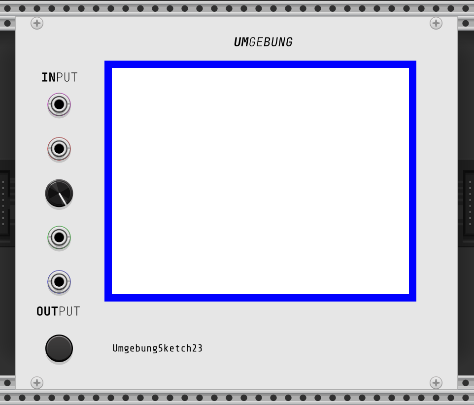

# Umfeld in VCV Rack

currently not more than a proof of concept, this projects aims to allow to run [umfeld](https://github.com/dennisppaul/umfeld) sketches as a module in [VCV Rack](https://vcvrack.com).

